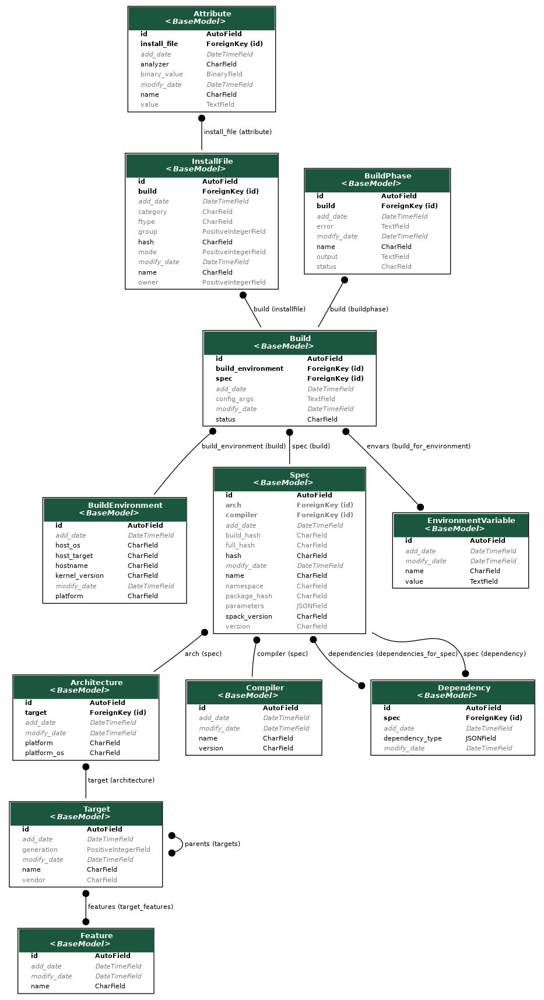

.. _development-tables:

======
Tables
======

The table design is represented in the models.py file of each app.
Once you have the application running, you can generate a graph as follows:

.. code-block:: console

    $ python manage.py graph_models main -o tables.png
    
    
Or from the outside of the container:

.. code-block:: console

    $ docker exec -it spack-monitor_uwsgi_1 python manage.py graph_models main -o tables.png
    $ mv tables.png docs/development/img/
    
The output looks like this:

