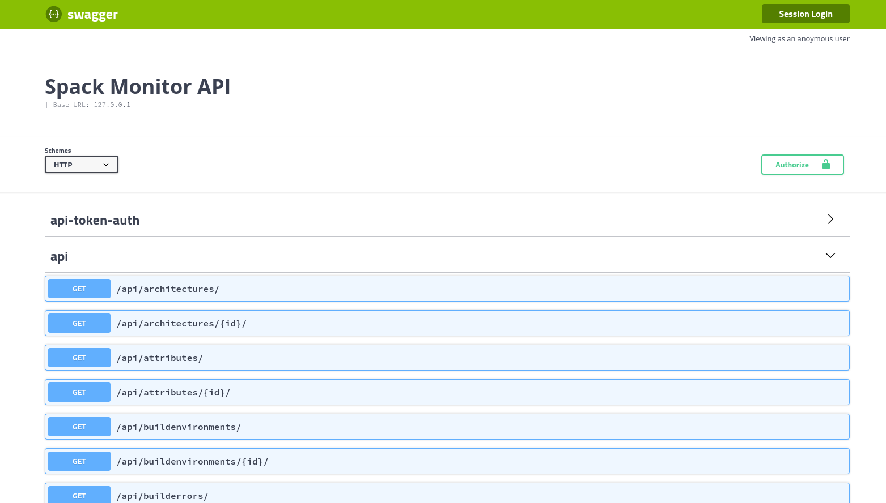

.. _getting-started_data_api:

======================================
Data Application Programming Interface
======================================

Unlike the API that is used to interact with Spack Monitor from Spack, the data
API exists only to expose data in Spack Monitor. For the time being, it is entirely public.
If you want to explore data in spack monitor (or see endpoints that you can use
from a client like Python or curl) you should browse to ``api/docs`` to
see a full schema:

Generally, clicking on "api" and then the GET endpoint of your choosing will
give you a preview, and then you can mimic the curl command or reproduce in Python.
For example, for the builds endpoint, I can do this curl request for a local
spack monitor:

.. code-block::console

    $ curl -X GET "http://127.0.0.1/api/builds/" -H  "accept: application/json"

Or in Python

.. code-block::python

    import requests
    response = requests.get("http://127.0.0.1/api/builds/")
    response.json()
    

If appropriate, this can eventually be made into a client.
