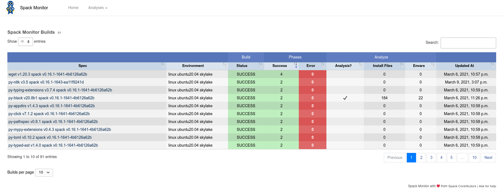
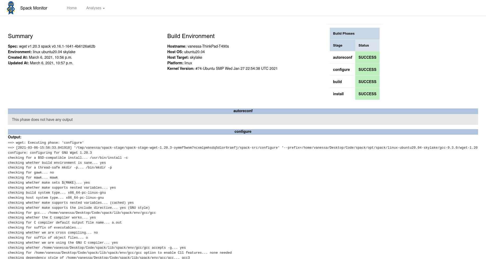
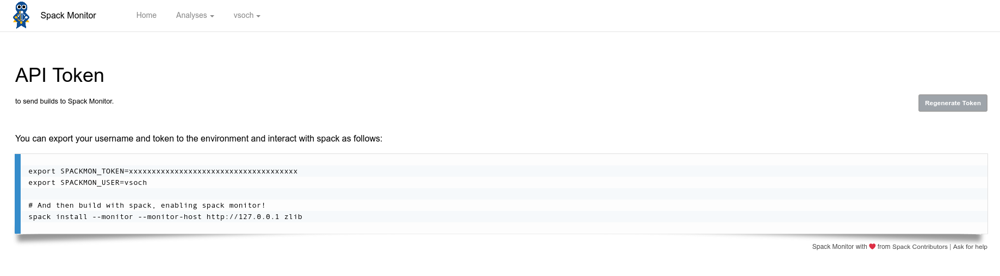

.. _getting-started_interfaces:

==========
Interfaces
==========

Spackmon currently has two simple views that will be expanded upon based on our needs.

----
Home
----

The home view shows a table of current builds. This is rendered in the web page,
and will be switched to server side rendering as the number of builds gets large.
You can distinguish whether a build was just run (meaning it has phases and output)
vs. added via an analysis (meaning we don't have build phase output, but analysis results)
or both based on the Analysis column. In the future we might want a better way to distinguish
these different types.

---------------
Build Interface
---------------

The build interface shows basic summary, install environment, and phase information,
along with complete output for each phase (given that the build has associated phases).

------------
User Account
------------

When you login, you can view your token page, which shows how to export your
username and token to the environment, and then interact with the Spack Monitor
server from spack:

